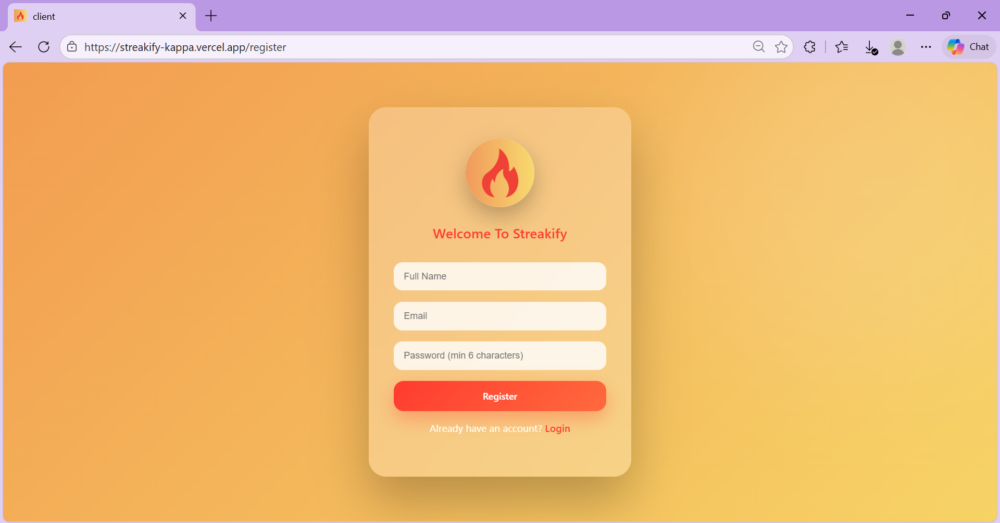
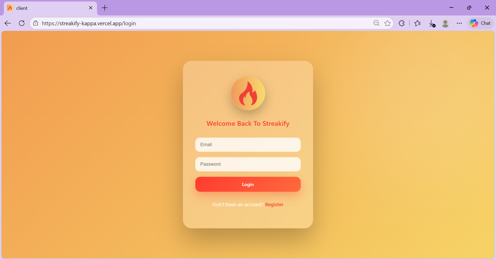
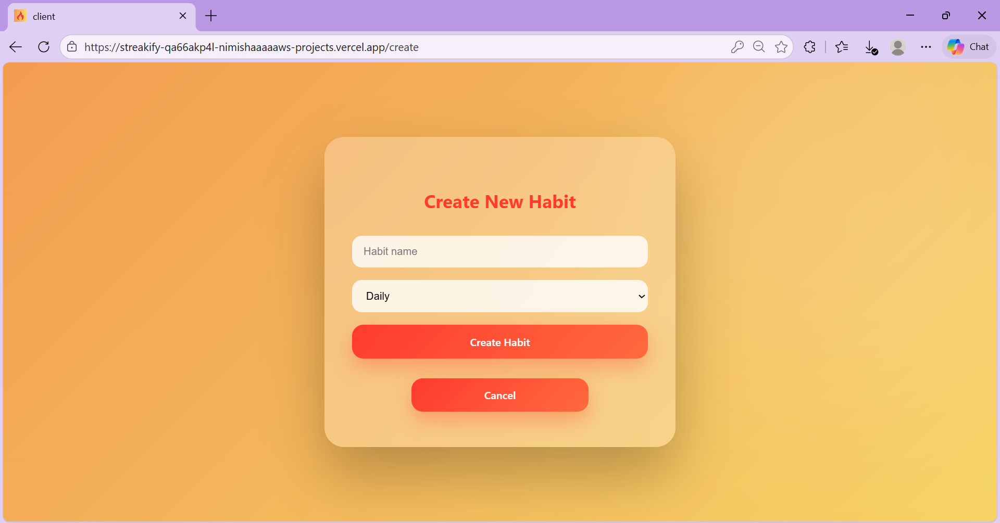

# 🔥 Streakify

A modern full-stack habit tracking application with analytics, heatmaps, and secure authentication.

Live Demo: https://your-vercel-link.vercel.app  
Backend API: https://streakify-nuij.onrender.com  

---

## 🚀 Deployment Status

[](https://your-vercel-link.vercel.app)
[](https://streakify-nuij.onrender.com)
[](https://cloud.mongodb.com)

---

## ✨ Features

- 🔐 JWT Authentication (Register / Login)
- 📊 Habit Analytics Dashboard
- 🔥 GitHub-style Heatmap
- 📈 Streak Tracking System
- 🧠 Smart Habit Logging
- 📱 Responsive UI (Glassmorphism + Gradient Theme)
- ☁️ Deployed Full Stack (Render + Vercel)

---

## 🛠 Tech Stack

### Frontend
- React (Vite)
- CSS (Glassmorphism UI)
- Axios / Fetch API

### Backend
- Node.js
- Express.js
- MongoDB
- Mongoose
- JWT Authentication

### Deployment
- Vercel (Frontend)
- Render (Backend)
- MongoDB Atlas (Database)

---

## 📸 Screenshots

### 🔑 Authentication




### 📊 Dashboard



### 🔥 Heatmap


---

## ⚙️ Environment Variables

### Backend (.env)

```
PORT=5000
MONGO_URI=your_mongodb_connection_string
JWT_SECRET=your_secret_key
```

### Frontend (.env)

```
VITE_API_URL=https://streakify-nuij.onrender.com/api
```

---

## 🖥 Run Locally

### Clone Repository

```
git clone https://github.com/your-username/streakify.git
cd streakify
```

### Backend

```
cd server
npm install
npm run dev
```

### Frontend

```
cd client
npm install
npm run dev
```

---

## 📌 Future Improvements

- 🔁 Auto-login persistence
- 📧 Forgot Password functionality
- 📅 Habit reminders
- 📈 Advanced analytics charts
- 🌙 Dark mode toggle

---

## 👩‍💻 Author

Nimisha Majgawali  
Full Stack Developer  
